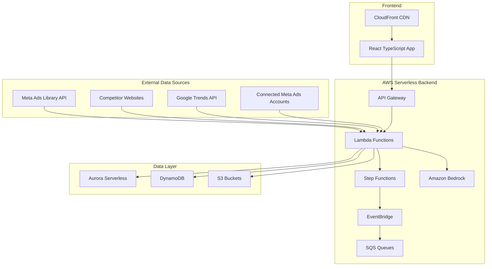

# Design Document: StratScout Competitive Intelligence Platform

## Overview

StratScout is a serverless, AI-powered competitive intelligence platform built on AWS that transforms raw marketing data into actionable strategic insights for D2C brands. The platform leverages Amazon Bedrock's Claude 3 Sonnet model for advanced AI analysis, combined with a modern React TypeScript frontend and a robust serverless backend architecture.

The system operates on an event-driven architecture where data ingestion triggers AI analysis pipelines, which generate insights that are immediately available through real-time dashboards. The platform specializes in the Indian D2C market, providing culturally-aware analysis and region-specific competitive intelligence.

## Architecture

### High-Level Architecture



### Event-Driven Data Flow

The platform follows an event-driven architecture where:

1. **Data Ingestion Events**: Scheduled Lambda functions poll external APIs and trigger data collection events
2. **Processing Events**: New data triggers Step Function workflows for AI analysis
3. **Analysis Events**: Completed analysis triggers dashboard update events
4. **Alert Events**: Significant competitive changes trigger real-time alert events

### Microservices Architecture

The backend is decomposed into focused microservices:

- **Data Ingestion Service**: Handles all external data collection
- **AI Analysis Service**: Manages Bedrock interactions and insight generation
- **Alert Service**: Processes and delivers real-time notifications
- **Dashboard Service**: Serves frontend data and manages user sessions
- **Porter Analysis Service**: Specialized service for competitive force analysis
- **Campaign Prediction Service**: Handles predictive analytics workflows
- **Scout Chatbot Service**: Manages conversational AI interactions and natural language processing
- **Chart Generation Service**: Creates dynamic visualizations based on user requests
- **Report Generation Service**: Produces comprehensive reports using platform data

## Components and Interfaces

### Core Components

#### 1. Data Ingestion Service

**Purpose**: Collect and normalize data from external sources

**Key Functions**:
- `collectMetaAdsData(competitors: string[]): Promise<AdData[]>`
- `scrapeCompetitorWebsites(urls: string[]): Promise<WebsiteData[]>`
- `fetchGoogleTrends(keywords: string[]): Promise<TrendData[]>`
- `syncConnectedAccounts(accountIds: string[]): Promise<AccountData[]>`

**Interfaces**:
```typescript
interface AdData {
  id: string;
  advertiserId: string;
  creativeUrl: string;
  adText: string;
  targetingInfo: TargetingData;
  publishedDate: Date;
  isActive: boolean;
}

interface WebsiteData {
  url: string;
  content: string;
  metadata: PageMetadata;
  scrapedAt: Date;
}
```

#### 2. AI Analysis Engine

**Purpose**: Process raw data through Amazon Bedrock for strategic insights

**Key Functions**:
- `analyzeAdCreatives(ads: AdData[]): Promise<CreativeInsights>`
- `extractMessagingStrategy(content: string[]): Promise<MessagingAnalysis>`
- `generateCompetitorProfile(data: CompetitorData): Promise<CompetitorProfile>`
- `predictCampaignPerformance(campaign: CampaignData): Promise<PredictionResult>`

**Bedrock Integration**:
```typescript
interface BedrockAnalysisRequest {
  modelId: 'anthropic.claude-3-sonnet-20240229-v1:0';
  prompt: string;
  maxTokens: number;
  temperature: number;
}

interface BedrockAnalysisResponse {
  content: string;
  confidence: number;
  usage: TokenUsage;
}
```

#### 3. Porter Analysis Service

**Purpose**: Automated Porter's Five Forces analysis

**Key Functions**:
- `analyzeSupplierPower(industryData: IndustryData): Promise<ForceScore>`
- `analyzeBuyerPower(marketData: MarketData): Promise<ForceScore>`
- `analyzeCompetitiveRivalry(competitors: CompetitorData[]): Promise<ForceScore>`
- `analyzeThreatOfSubstitutes(products: ProductData[]): Promise<ForceScore>`
- `analyzeThreatOfNewEntrants(barriers: BarrierData[]): Promise<ForceScore>`

**Analysis Output**:
```typescript
interface PorterAnalysis {
  supplierPower: ForceScore;
  buyerPower: ForceScore;
  competitiveRivalry: ForceScore;
  threatOfSubstitutes: ForceScore;
  threatOfNewEntrants: ForceScore;
  overallIntensity: number;
  evidence: EvidenceItem[];
  lastUpdated: Date;
}
```

#### 5. Scout Chatbot Service

**Purpose**: Provide conversational AI interface for querying platform data and generating insights

**Key Functions**:
- `processNaturalLanguageQuery(query: string, context: ConversationContext): Promise<ChatResponse>`
- `interpretUserIntent(query: string): Promise<QueryIntent>`
- `generateContextualResponse(data: any[], intent: QueryIntent): Promise<string>`
- `maintainConversationContext(sessionId: string, interaction: ChatInteraction): Promise<void>`

**Interfaces**:
```typescript
interface ChatResponse {
  message: string;
  data?: any[];
  charts?: ChartConfig[];
  confidence: number;
  sources: DataSource[];
  followUpSuggestions: string[];
}

interface QueryIntent {
  type: 'data_query' | 'chart_request' | 'report_request' | 'general_question';
  entities: ExtractedEntity[];
  parameters: QueryParameters;
  chartType?: 'bar' | 'pie' | 'line';
}
```

#### 6. Chart Generation Service

**Purpose**: Create dynamic visualizations based on user requests and platform data

**Key Functions**:
- `generateBarChart(data: DataPoint[], config: ChartConfig): Promise<ChartResult>`
- `generatePieChart(data: DataPoint[], config: ChartConfig): Promise<ChartResult>`
- `generateLineChart(data: TimeSeriesData[], config: ChartConfig): Promise<ChartResult>`
- `selectOptimalVisualization(data: any[], intent: QueryIntent): Promise<ChartConfig>`

**Chart Configuration**:
```typescript
interface ChartConfig {
  type: 'bar' | 'pie' | 'line';
  title: string;
  xAxis?: AxisConfig;
  yAxis?: AxisConfig;
  colors: string[];
  responsive: boolean;
  annotations?: Annotation[];
}

interface ChartResult {
  config: ChartConfig;
  data: ProcessedChartData;
  insights: string[];
  downloadUrl?: string;
}
```

#### 7. Report Generation Service

**Purpose**: Produce comprehensive reports using platform data and AI analysis

**Key Functions**:
- `generateCompetitiveAnalysisReport(competitors: string[], timeframe: DateRange): Promise<Report>`
- `generatePorterAnalysisReport(industry: string): Promise<Report>`
- `generateGapAnalysisReport(brandId: string): Promise<Report>`
- `compileExecutiveSummary(reportData: ReportData): Promise<ExecutiveSummary>`

**Report Structure**:
```typescript
interface Report {
  id: string;
  title: string;
  executiveSummary: ExecutiveSummary;
  sections: ReportSection[];
  charts: ChartResult[];
  recommendations: Recommendation[];
  metadata: ReportMetadata;
  downloadFormats: ('pdf' | 'docx' | 'html')[];
}

interface ReportSection {
  title: string;
  content: string;
  charts?: ChartResult[];
  data?: any[];
  insights: string[];
}
```

#### 4. Dashboard Service

**Purpose**: Serve frontend data and manage real-time updates

**Key Functions**:
- `getOverviewDashboard(brandId: string): Promise<DashboardData>`
- `getCompetitorDeepDive(competitorId: string): Promise<DeepDiveData>`
- `getStrategyComparison(competitorIds: string[]): Promise<ComparisonData>`
- `subscribeToAlerts(brandId: string): WebSocketConnection`

### Frontend Components

#### 1. Overview Dashboard

**Components**:
- `AlertCardsContainer`: Displays urgent opportunity alerts
- `MarketPositionChart`: Horizontal bar chart for ad volume comparison
- `PorterRadarChart`: Interactive radar chart for five forces
- `MessagingMixChart`: Donut chart for messaging strategy distribution
- `CompetitorTrackingCards`: Quick access to competitor profiles

#### 2. Competitor Deep Dive

**Components**:
- `CreativeTimelineView`: Timeline visualization of ad creative evolution
- `VisualThemeAnalyzer`: Color palette and design pattern analysis
- `MessagingStrategyBreakdown`: Keywords, hooks, and CTA pattern analysis
- `CampaignTimingIntelligence`: Historical and predictive timeline view

#### 3. Strategy Comparison

**Components**:
- `KPISummaryCards`: Comparative metrics display
- `PerformanceRadarChart`: Multi-competitor performance comparison
- `DetailedMetricsTable`: Sortable comparison table
- `AIRecommendationsPanel`: Generated recommendations based on analysis

#### 4. Scout Chatbot Interface

**Components**:
- `ChatWindow`: Main conversational interface with message history
- `QueryInputField`: Natural language input with auto-suggestions
- `ResponseRenderer`: Displays AI responses with embedded charts and data
- `ConversationHistory`: Maintains chat context and previous interactions
- `ChartEmbedder`: Renders generated charts within chat responses
- `ReportDownloader`: Handles report generation and download links

#### 5. Dynamic Chart Components

**Components**:
- `ConversationalBarChart`: Bar charts generated from Scout requests
- `ConversationalPieChart`: Pie charts created through natural language
- `ConversationalLineChart`: Time-series charts from conversational queries
- `ChartInsightPanel`: AI-generated insights accompanying each chart
- `ChartExportOptions`: Download and sharing options for generated charts

## Data Models

### Core Entities

#### Competitor Profile
```typescript
interface CompetitorProfile {
  id: string;
  name: string;
  industry: string;
  website: string;
  metaAdAccountId?: string;
  trackingStatus: 'active' | 'paused' | 'inactive';
  lastAnalyzed: Date;
  
  // Analysis Results
  messagingStrategy: MessagingStrategy;
  visualThemes: VisualTheme[];
  campaignPatterns: CampaignPattern[];
  performanceMetrics: PerformanceMetrics;
}
```

#### Campaign Analysis
```typescript
interface CampaignAnalysis {
  id: string;
  competitorId: string;
  campaignName: string;
  startDate: Date;
  endDate?: Date;
  
  // Creative Analysis
  adCreatives: AdCreative[];
  visualThemes: VisualTheme[];
  messagingHooks: string[];
  ctaPatterns: CTAPattern[];
  
  // Performance Predictions
  predictedReach: PredictionRange;
  predictedEngagement: PredictionRange;
  confidenceScore: number;
  
  // Timing Intelligence
  launchTiming: TimingAnalysis;
  seasonalFactors: SeasonalFactor[];
}
```

#### Market Intelligence
```typescript
interface MarketIntelligence {
  id: string;
  industry: string;
  region: 'india';
  
  // Porter's Five Forces
  porterAnalysis: PorterAnalysis;
  
  // Market Gaps
  identifiedGaps: MarketGap[];
  recommendations: Recommendation[];
  
  // Trend Analysis
  emergingTrends: Trend[];
  seasonalPatterns: SeasonalPattern[];
  
  lastUpdated: Date;
}
```

#### Scout Conversation
```typescript
interface ConversationSession {
  id: string;
  userId: string;
  brandId: string;
  startedAt: Date;
  lastInteractionAt: Date;
  context: ConversationContext;
  interactions: ChatInteraction[];
  isActive: boolean;
}

interface ChatInteraction {
  id: string;
  timestamp: Date;
  userQuery: string;
  scoutResponse: ChatResponse;
  generatedCharts?: ChartResult[];
  generatedReports?: string[];
  feedback?: UserFeedback;
}

interface ConversationContext {
  currentTopic?: string;
  mentionedCompetitors: string[];
  timeframe?: DateRange;
  lastDataQuery?: QueryParameters;
  preferredChartTypes: string[];
}
```

#### Generated Content
```typescript
interface GeneratedReport {
  id: string;
  sessionId: string;
  title: string;
  type: 'competitive_analysis' | 'porter_analysis' | 'gap_analysis' | 'custom';
  content: ReportContent;
  generatedAt: Date;
  downloadUrls: DownloadUrl[];
  metadata: ReportMetadata;
}

interface ConversationalChart {
  id: string;
  sessionId: string;
  interactionId: string;
  type: 'bar' | 'pie' | 'line';
  title: string;
  data: ProcessedChartData;
  config: ChartConfig;
  insights: string[];
  createdAt: Date;
}
```

### Data Storage Strategy

#### Aurora Serverless (SQL Data)
- Competitor profiles and relationships
- Campaign metadata and performance history
- User accounts and brand configurations
- Porter analysis historical data
- Conversation sessions and chat history
- Generated reports metadata

#### DynamoDB (Real-time Data)
- Live ad tracking data
- Real-time alerts and notifications
- User session data
- Dashboard cache data
- Active conversation contexts
- Chart generation cache

#### S3 (Media Storage)
- Ad creative images and videos
- Competitor website screenshots
- Generated reports and exports
- Analysis artifacts and evidence
- Generated chart images and exports
- Conversation-generated content
- Generated reports and exports
- Analysis artifacts and evidence

## Error Handling

### Error Categories

#### 1. External API Errors
- **Meta Ads Library Rate Limits**: Implement exponential backoff with jitter
- **Website Scraping Failures**: Retry with different user agents and proxy rotation
- **Google Trends API Limits**: Queue requests and batch processing
- **Bedrock Service Limits**: Implement request queuing and priority handling

#### 2. Data Processing Errors
- **Invalid Data Formats**: Validate and sanitize all external data
- **AI Analysis Failures**: Fallback to rule-based analysis when Bedrock fails
- **Missing Competitor Data**: Graceful degradation with partial analysis
- **Timeout Errors**: Implement circuit breakers for long-running operations

#### 3. Frontend Errors
- **Network Connectivity**: Offline mode with cached data
- **Chart Rendering Failures**: Fallback to table views
- **Real-time Update Failures**: Polling fallback for WebSocket failures
- **Authentication Errors**: Automatic token refresh and re-authentication

### Error Recovery Strategies

#### Retry Mechanisms
```typescript
interface RetryConfig {
  maxAttempts: number;
  baseDelay: number;
  maxDelay: number;
  backoffMultiplier: number;
  jitterEnabled: boolean;
}

const apiRetryConfig: RetryConfig = {
  maxAttempts: 3,
  baseDelay: 1000,
  maxDelay: 30000,
  backoffMultiplier: 2,
  jitterEnabled: true
};
```

#### Circuit Breaker Pattern
```typescript
interface CircuitBreakerState {
  state: 'closed' | 'open' | 'half-open';
  failureCount: number;
  lastFailureTime: Date;
  successCount: number;
}
```

#### Graceful Degradation
- Display cached data when real-time updates fail
- Show confidence indicators when AI analysis is incomplete
- Provide manual refresh options when automatic updates fail
- Maintain core functionality even when advanced features are unavailable

## Testing Strategy

### Dual Testing Approach

The testing strategy combines unit testing for specific scenarios with property-based testing for comprehensive validation of universal properties. This approach ensures both concrete bug detection and general correctness verification.

#### Unit Testing Focus
- API integration edge cases and error conditions
- UI component rendering with various data states
- Data transformation and validation logic
- Authentication and authorization flows
- Specific business logic examples

#### Property-Based Testing Focus
- Data processing pipelines with randomized inputs
- AI analysis consistency across different data sets
- Dashboard rendering with various competitor configurations
- Alert generation logic with diverse competitive scenarios
- Porter analysis scoring with different market conditions

### Testing Configuration

**Property-Based Testing Library**: For TypeScript/JavaScript, we'll use `fast-check` for comprehensive property testing.

**Test Configuration**:
- Minimum 100 iterations per property test
- Each property test references its design document property
- Tag format: **Feature: stratscout-competitive-intelligence, Property {number}: {property_text}**

**Integration Testing**:
- End-to-end testing of data ingestion pipelines
- AWS service integration testing with LocalStack
- Frontend-backend integration testing
- External API integration testing with mock services

## Correctness Properties

*A property is a characteristic or behavior that should hold true across all valid executions of a system—essentially, a formal statement about what the system should do. Properties serve as the bridge between human-readable specifications and machine-verifiable correctness guarantees.*

Based on the prework analysis of acceptance criteria, the following properties ensure the correctness of StratScout's core functionality:

### Property 1: Competitor Activity Detection Timeliness
*For any* new competitor ad published to external APIs, the Competitor_Monitor should detect and process it within the specified time window of 15 minutes.
**Validates: Requirements 1.1**

### Property 2: Alert Generation for Significant Activity
*For any* competitor activity data that meets significance thresholds, the Alert_System should generate corresponding urgent opportunity alerts.
**Validates: Requirements 1.2**

### Property 3: Website Change Capture Completeness
*For any* competitor website changes detected, the Data_Ingestion_Service should capture and store all change data without loss.
**Validates: Requirements 1.3**

### Property 4: Data Storage Timing and Consistency
*For any* monitoring data collected by the platform, it should be stored in the appropriate data store within 5 seconds while maintaining consistency across all storage systems.
**Validates: Requirements 1.5, 12.5**

### Property 5: AI Analysis Completeness
*For any* competitor ad data ingested, the AI_Analysis_Engine should produce complete analysis including visual themes, messaging patterns, targeting strategies, and all required insights.
**Validates: Requirements 2.1, 2.2, 2.5**

### Property 6: Confidence Score Provision
*For any* AI-generated insights, predictions, or analysis results, the system should provide confidence scores within valid ranges (0-1) for all outputs.
**Validates: Requirements 2.4, 4.1, 4.4**

### Property 7: Porter Analysis Completeness and Scoring
*For any* market data provided, the Porter_Analyzer should evaluate all five competitive forces, provide evidence-based scoring on a 1-10 scale, and maintain historical trends.
**Validates: Requirements 3.1, 3.2, 3.3, 3.4**

### Property 8: Campaign Prediction Completeness
*For any* competitor campaign analyzed, the Campaign_Predictor should generate predictions for reach, engagement, and duration with associated confidence scores.
**Validates: Requirements 4.2, 4.4**

### Property 9: Gap Analysis and Recommendation Generation
*For any* market and competitor data set, the Gap_Analyzer should identify market gaps, prioritize recommendations based on impact and feasibility, and provide actionable implementation guidance.
**Validates: Requirements 5.1, 5.2, 5.3**

### Property 10: Recommendation Updates with New Data
*For any* new competitive data that becomes available, the Gap_Analyzer should update existing recommendations to reflect the new information.
**Validates: Requirements 5.5**

### Property 11: UI Data Completeness for Dashboards
*For any* competitor data set, the Dashboard_UI should generate complete visualization data including market position charts, competitor tracking cards, comparison tables, and summary KPI cards.
**Validates: Requirements 6.2, 6.5, 8.1, 8.3**

### Property 12: Strategy Analysis Timeline Generation
*For any* competitor creative data, the Strategy_Decoder should provide complete timeline analysis including creative evolution, visual themes, messaging strategies, and timing intelligence.
**Validates: Requirements 7.1, 7.2, 7.3, 7.4**

### Property 13: Comparative Recommendation Generation
*For any* set of competitor performance data, the AI_Analysis_Engine should generate comparative recommendations based on performance differences and competitive advantages.
**Validates: Requirements 8.4**

### Property 14: Competitor Selection Limit Enforcement
*For any* user interaction with competitor selection, the Dashboard_UI should enforce the maximum limit of 5 competitors for simultaneous comparison.
**Validates: Requirements 8.5**

### Property 15: Website Scraping Data Generation
*For any* valid competitor website URL, the Data_Ingestion_Service should perform scraping and produce structured data results.
**Validates: Requirements 9.2**

### Property 16: Connected Account Data Access
*For any* connected Meta Ads account, the Data_Ingestion_Service should successfully access and retrieve benchmarking data.
**Validates: Requirements 9.4**

### Property 17: API Rate Limit Handling
*For any* API rate limit scenario encountered, the StratScout_Platform should implement appropriate retry mechanisms and eventually succeed or fail gracefully.
**Validates: Requirements 9.5**

### Property 18: Indian Language Translation
*For any* competitor content containing Indian languages, the AI_Analysis_Engine should recognize the languages and provide English translations.
**Validates: Requirements 10.3**

### Property 19: Auto-scaling Behavior
*For any* demand load scenario, the StratScout_Platform should auto-scale compute resources without manual intervention.
**Validates: Requirements 18.5**

### Property 20: Media File Storage
*For any* media files and ad creatives processed, the StratScout_Platform should store them correctly in S3 with appropriate metadata.
**Validates: Requirements 19.3**

### Property 21: Data Retention Policy Enforcement
*For any* data with defined retention policies, the StratScout_Platform should enforce retention rules and clean up expired data automatically.
**Validates: Requirements 19.4**

### Property 22: Real-time UI Updates
*For any* new alerts or data generated, the Dashboard_UI should push real-time updates to connected clients.
**Validates: Requirements 20.4**

### Property 23: Demo Data Completeness
*For any* major platform feature, the Demo_Environment should include corresponding contextual data that demonstrates the feature's functionality.
**Validates: Requirements 21.5**

### Property 24: Scout Query Response Accuracy
*For any* user question about overview or strategy data, the Scout_Chatbot should provide accurate answers based on the platform's ingested data with proper citations and confidence indicators.
**Validates: Requirements 15.1, 15.4**

### Property 25: Natural Language Query Processing
*For any* natural language query submitted to Scout, the Query_Processor should interpret the query and convert it to appropriate data queries that retrieve relevant information.
**Validates: Requirements 15.2**

### Property 26: Conversation Context Maintenance
*For any* conversation session with follow-up questions, the Scout_Chatbot should maintain context properly to handle clarifications and related queries.
**Validates: Requirements 15.5**

### Property 27: Comprehensive Chart Generation
*For any* chart request (bar, pie, or line), the Chart_Generator should create appropriate visualizations using relevant platform data with automatic field selection based on the natural language request.
**Validates: Requirements 16.1, 16.2, 16.3, 16.4**

### Property 28: Chart Output Completeness
*For any* generated chart, the Scout_Chatbot should provide chart descriptions and key insights alongside the visualizations.
**Validates: Requirements 16.5**

### Property 29: Comprehensive Report Generation
*For any* report request, the Report_Generator should create comprehensive documents using all relevant platform data and incorporate AI-generated insights and recommendations.
**Validates: Requirements 17.1, 17.3**

### Property 30: Report Structure and Content Completeness
*For any* generated report, the Report_Generator should include Porter's Five Forces analysis, competitor profiles, gap analysis, appropriate sections, charts, and executive summaries with proper formatting.
**Validates: Requirements 17.2, 17.4**

### Property 31: Report Delivery and Summary
*For any* completed report, the Scout_Chatbot should provide download options and summary highlights of key findings.
**Validates: Requirements 17.5**